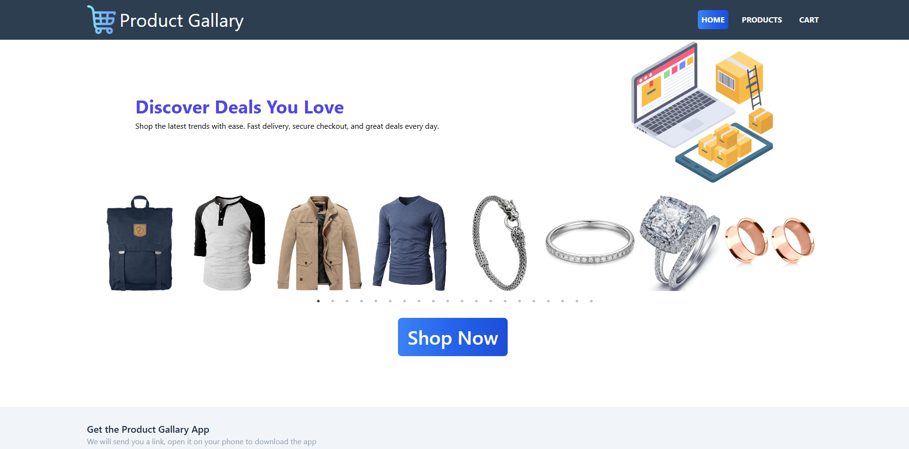
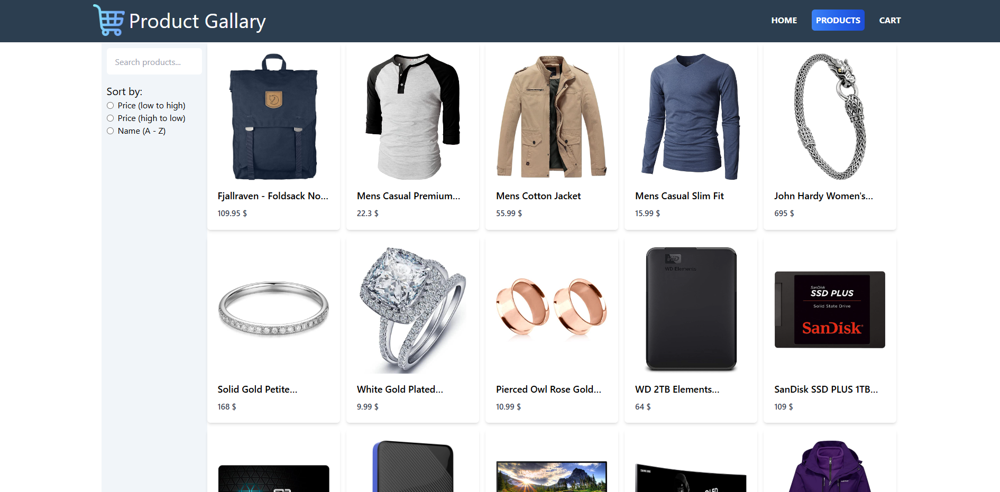
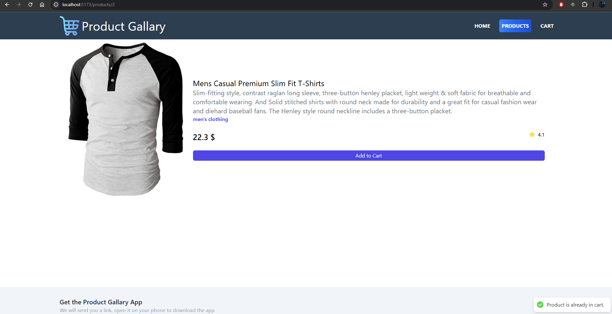
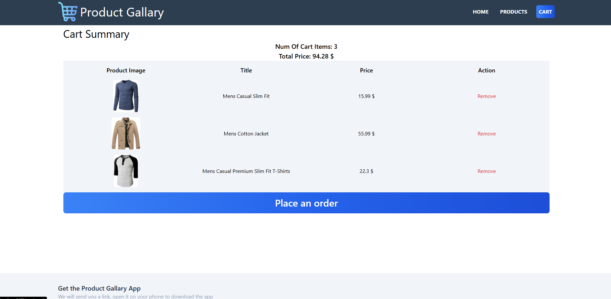
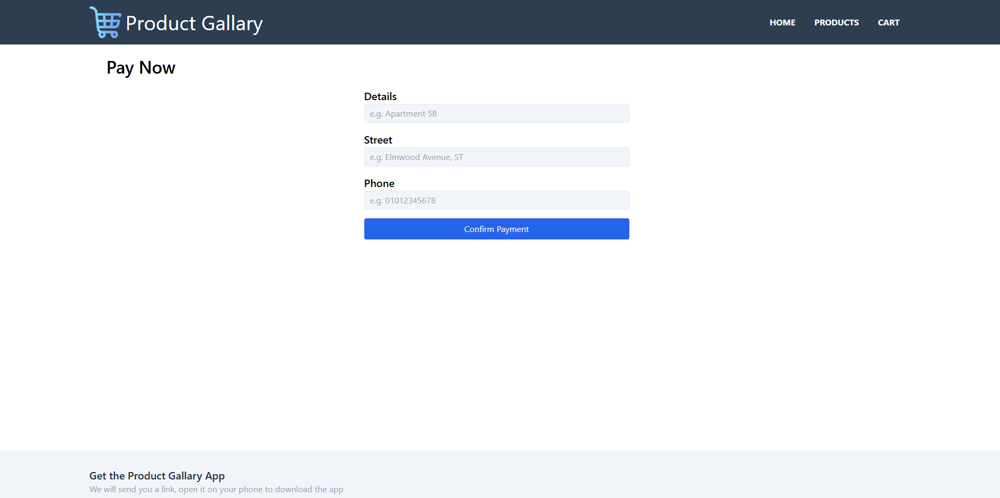

# React + Vite

This template provides a minimal setup to get React working in Vite with HMR and some ESLint rules.

Currently, two official plugins are available:

- [@vitejs/plugin-react](https://github.com/vitejs/vite-plugin-react/blob/main/packages/plugin-react) uses [Babel](https://babeljs.io/) for Fast Refresh
- [@vitejs/plugin-react-swc](https://github.com/vitejs/vite-plugin-react/blob/main/packages/plugin-react-swc) uses [SWC](https://swc.rs/) for Fast Refresh

## Expanding the ESLint configuration

If you are developing a production application, we recommend using TypeScript with type-aware lint rules enabled. Check out the [TS template](https://github.com/vitejs/vite/tree/main/packages/create-vite/template-react-ts) for information on how to integrate TypeScript and [`typescript-eslint`](https://typescript-eslint.io) in your project.

------------------------------------

🛒 E-Commerce Product Gallary App – Project Overview
This is a simple, responsive e-commerce web application built with React. It allows users to browse products, view detailed information, add items to a shopping cart, and simulate a checkout process via a payment page. The app is designed to demonstrate core front-end concepts such as state management, routing, form handling.

------------------------------------

Tech Used:

📦 Frontend Framework
React ^19.1.0 – Core UI framework

React DOM – Rendering for the browser

🚦 Routing
React Router DOM ^7.7.1 – Routing and navigation between pages

🎨 Styling
Tailwind CSS ^3.4.17 – Utility-first CSS framework

Slick Carousel (react-slick + slick-carousel) – For responsive image sliders

Font Awesome Free – Icon library

📥 HTTP & Data
Axios ^1.11.0 – HTTP client for API calls

🧠 Forms & Validation
Formik ^2.4.6 – Form state management

Yup ^1.6.1 – Form validation

📄 SEO
React Helmet ^6.1.0 – Manage document head (title, meta tags)

🔥 Notifications
React Hot Toast ^2.5.2 – Toast notification system

## 📸 Screenshots

### 🏠 Home Page

### 🛍️ Products Page

### 🛍️ Product Details Page

### 🛍️ Cart Page

### 🛍️ Payment Page
